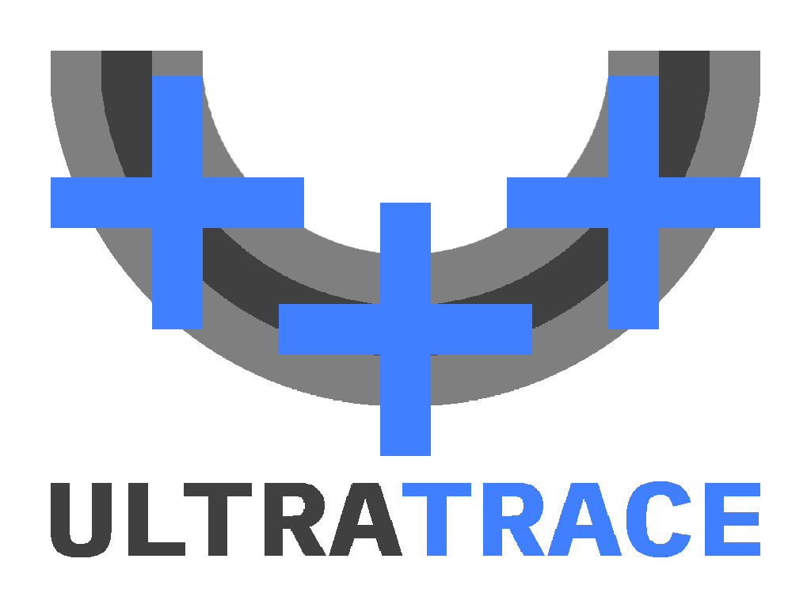
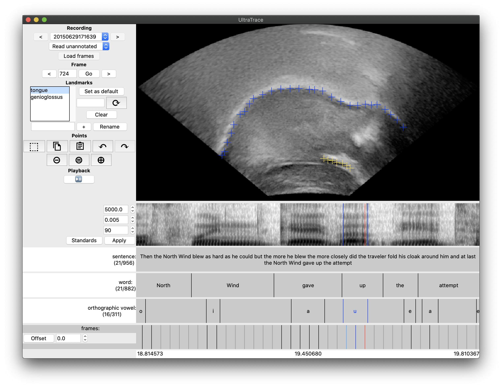

# UltraTrace
This is a tool for [currently] manual annotation of 2D UTI (Ultrasound Tongue Imaging) data.



You can have a look at our [UltraFest IX presentation](https://swatphonlab.github.io/2020-UltraTrace-presentation/presentation.html) for some details on featureset and functionality as of October, 2020.

If you use UltraTrace in your work, you may cite the UltraFest IX presentation:
- Murphy, Kevin, Nathaniel Ziv Stern, Daniel Swanson, Caleb Ho, and Jonathan Washington (2020).  _UltraTrace: A free/open-source cross-platform tool for manual annotation of ultrasound tongue imaging data._  Presentation at UltraFest IX.  Software available online at https://github.com/SwatPhonLab/UltraTrace .

## Screenshot


## Installation

### Linux (apt or dnf)

1. Download the UltraTrace source code, e.g. using `git`.
2. Run setup in the UltraTrace directory:
```bash
$ ./install.sh
$ python3 setup.py install
```

### macOS

1. Install [Homebrew](https://brew.sh).
2. Download the UltraTrace source code, e.g. using `git`.
3. Run setup in the UltraTrace directory:
```bash
$ python3 setup.py install
```

### Windows

1. Install python3
2. Make sure you have pip
3. Install ffmpeg and add to PATH
4. Run `setup.py`

## Use

```bash
$ python3 -m ultratrace /path/to/data
```

### Data format

The minimum data required for UltraTrace to run is at least one ultrasound file and at least one audio file (supported formats listed below).  Annotation files store timing of the ultrasound frames as well as any linguistic information of use (words, segments, etc.).  Corresponding ultrasound, audio, and annotation files should have the same base name (everything except the extension), and may be symlinked or stored in subdirectories.  (The naming convention for AAA-exported data is a little different.)

#### Supported data formats
* ultrasound: DICOM (.dicom, .dcm), AAA-exported scanline data (.ult)
* audio: .wav, .flac
* text alignment: .TextGrid
* traces/splines: native .json, old native .measurement, AAA-exported splines

#### Supported data access methods:
Reading DICOM data is supported in the following ways:
* Reading native pixel data directly
* Converting pixel data to PNG
* Reading from Philips scanline data

Alignment of audio and ultrasound frames supports the following methods:
* From native Philips timing data
* Generated from DICOM frametime (or framerate) specification
* Manual adjustment of alignment
* Stored in TextGrids (actively stores above methods this way; can read alignment previously stored this way)
* Future: auxiliary synchronisation data

### Themes

The theme should just look right on Mac.

#### Setting the theme on linux

Use pip3 to install ttkthemes.

Add the following line to your `~/.Xresources` file:

```
*TtkTheme: arc
```

You may select something other than clam for your theme.  Currently, the main options are something like this: `arc`, `plastik`, `clearlooks`, `elegance`, `radiance`, `equilux`, `black`, `smog`, `scidblue`, etc.  See the [ttkthemes documentation](https://ttkthemes.readthedocs.io/) for more information.

Otherwise it'll fall back to `*TtkTheme`, and if that's not specified in `~/.Xresources`, it'll fall back to `clam`.
